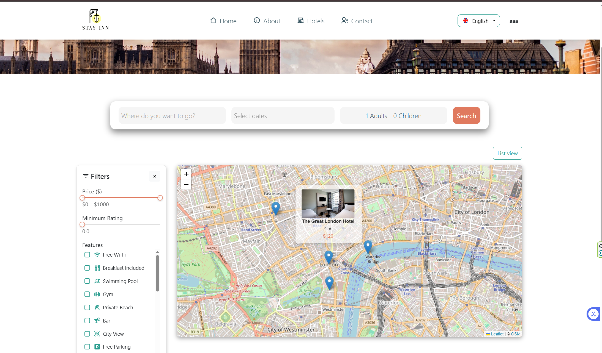

This is a full-stack hotel reservation application where users can search for hotels, filter results, view details on maps, pick dates, book rooms, and complete payments. It comes with role-based access (user, admin, manager) and a modern front-end + Java backend setup.

HOW TO INSTALL AND RUN THE PROJECT

1. Download, clone the project files, you can clone from the GitHub repo: 
   https://github.com/hasntezcan/HotelsRezervationSystem.git

2. Open a terminal and navigate into the project folder:
   cd <folder-name>

3. Make sure Node.js and java is installed on your system (nodejs.org).

4. Run this command to install all required packages:
   npm install

5. Start the development server:
   npm run dev

6. Open your browser and go to the link shown in the terminal.

Login informations for different roles:

-user-
user@gmail.com
user123
--------
-admin-
admin@gmail.com
admin123
--------
-manager-
manager@gmail.com
manager123

## 📸 Screenshots

<table>
  <tr>
    <td width="48%">
      
       aboutUs
    </td>
    <td width="48%">
      
       bookings
    </td>
  </tr>
  <tr>
    <td width="48%">
      
       cities
    </td>
    <td width="48%">
      
       contact
    </td>
  </tr>
  <tr>
    <td width="48%">
      
       detay_map
    </td>
    <td width="48%">
      
       detay
    </td>
  </tr>
  <tr>
    <td width="48%">
      
       filter
    </td>
    <td width="48%">
      
       home
    </td>
  </tr>
  <tr>
    <td width="48%">
      
       home2
    </td>
    <td width="48%">
      
       hotels
    </td>
  </tr>
  <tr>
    <td width="48%">
      
       login
    </td>
    <td width="48%">
      
       map
    </td>
  </tr>
  <tr>
    <td width="48%">
      
       ödeme
    </td>
    <td width="48%">
      
       profil
    </td>
  </tr>
  <tr>
    <td width="48%">
      
       rewiew
    </td>
    <td width="48%">
      
       rewiew2
    </td>
  </tr>
  <tr>
    <td width="48%">
      
       room
    </td>
    <td width="48%">
      
       room2
    </td>
  </tr>
  <tr>
    <td width="48%">
      
       searchResult
    </td>
    <td width="48%">
      
       tarihsecimi
    </td>
  </tr>
  <tr>
    <td width="48%">
      
       ThankYou
    </td>
    <td width="48%">&nbsp;</td>
  </tr>
</table>
